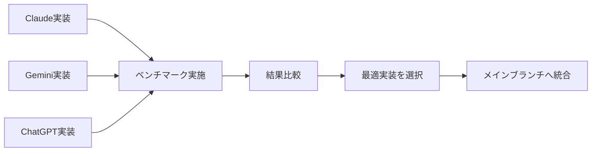

# AI実装 Worktree 開発ガイド

3つのAI実装を並行開発するための環境構築とワークフローガイド

---

## 📁 ディレクトリ構造

```
applicationDevelop/
├── quickMemoApp/              # メイン（統合版）
│   ├── Branch: feature/integrated-ai
│   ├── AI_BENCHMARK_COMPARISON.md
│   └── [既存のファイル...]
│
├── quickMemoApp-claude/       # Claude専用実装
│   ├── Branch: feature/ai-claude
│   ├── AI_IMPLEMENTATION_CLAUDE.md
│   └── [同じファイル構造...]
│
├── quickMemoApp-gemini/       # Gemini専用実装
│   ├── Branch: feature/ai-gemini
│   ├── AI_IMPLEMENTATION_GEMINI.md
│   └── [同じファイル構造...]
│
└── quickMemoApp-codex/        # ChatGPT専用実装
    ├── Branch: feature/ai-codex
    ├── AI_IMPLEMENTATION_CODEX.md
    └── [同じファイル構造...]
```

---

## 🚀 クイックスタート

### 1. ブランチ間の移動

```bash
# メイン（統合版）で作業
cd quickMemoApp

# Claudeブランチで作業
cd ../quickMemoApp-claude

# Geminiブランチで作業
cd ../quickMemoApp-gemini

# ChatGPTブランチで作業
cd ../quickMemoApp-codex
```

### 2. Xcode で開く

各ディレクトリで：
```bash
open quickMemoApp.xcodeproj
```

または、複数同時に開く：
```bash
# メインとClaudeを同時に開く
open quickMemoApp/quickMemoApp.xcodeproj
open quickMemoApp-claude/quickMemoApp.xcodeproj
```

---

## 🔄 ワークフロー

### パターン1: 個別開発 → ベンチマーク → 統合



#### 手順

1. **各ブランチで実装**
   ```bash
   cd quickMemoApp-claude
   # Claude専用の実装
   git add .
   git commit -m "feat: Claude AI タグ抽出機能実装"
   ```

2. **ベンチマーク実行**
   - 各ブランチで同じテストデータを使用
   - `AI_BENCHMARK_COMPARISON.md` に結果を記録

3. **最適実装を選択**
   - ベンチマーク結果に基づいて決定
   - または、ハイブリッド実装（機能ごとに使い分け）

4. **メインブランチへ統合**
   ```bash
   cd quickMemoApp
   git checkout feature/integrated-ai
   git merge feature/ai-claude  # または cherry-pick
   ```

### パターン2: 機能別実装

各AIプロバイダーで異なる機能を実装：
- **Claude**: メモアレンジ
- **Gemini**: タグ抽出
- **ChatGPT**: カテゴリー要約

```bash
# Claudeブランチでメモアレンジを実装
cd quickMemoApp-claude
# 実装...

# Geminiブランチでタグ抽出を実装
cd ../quickMemoApp-gemini
# 実装...

# 各実装をメインへ統合
cd ../quickMemoApp
git cherry-pick <claude-commit-id>
git cherry-pick <gemini-commit-id>
```

---

## 📊 ベンチマーク実施手順

### 1. テストデータの準備

`AI_BENCHMARK_COMPARISON.md` に記載されているサンプルメモを使用：
- 短文（<50字）
- 中文（50-200字）
- 長文（>200字）

### 2. 各ブランチでテスト実行

```bash
# Claudeブランチ
cd quickMemoApp-claude
# Xcodeでアプリをビルド・実行
# テストデータでAI機能を実行
# 結果を記録

# Geminiブランチ
cd ../quickMemoApp-gemini
# 同様にテスト

# ChatGPTブランチ
cd ../quickMemoApp-codex
# 同様にテスト
```

### 3. 測定項目

各処理で以下を記録：
- ✅ レスポンス時間（秒）
- ✅ トークン使用量（入力/出力）
- ✅ 結果の品質（主観評価）
- ✅ エラー発生回数

### 4. 結果の記録

`quickMemoApp/AI_BENCHMARK_COMPARISON.md` を更新

---

## 🛠️ 便利なGitコマンド

### Worktree管理

```bash
# Worktree一覧を確認
git worktree list

# 新しいWorktreeを追加
git worktree add ../quickMemoApp-new -b feature/ai-new

# Worktreeを削除
git worktree remove ../quickMemoApp-claude

# 不要なWorktreeをクリーンアップ
git worktree prune
```

### ブランチ間の比較

```bash
# 2つのブランチのファイルを比較
git diff feature/ai-claude feature/ai-gemini -- quickMemoApp/Services/AIManager.swift

# 変更内容を確認
git log feature/ai-claude --oneline

# 特定のコミットを確認
git show <commit-id>
```

### Cherry-pick（選択的に統合）

```bash
# メインブランチへ移動
cd quickMemoApp
git checkout feature/integrated-ai

# Claudeブランチの特定のコミットを取り込む
git cherry-pick <commit-id>

# 複数のコミットを一度に取り込む
git cherry-pick <commit-id-1> <commit-id-2> <commit-id-3>

# コンフリクトが発生した場合
git status  # コンフリクトファイルを確認
# ファイルを編集して解決
git add .
git cherry-pick --continue
```

---

## 💡 ベストプラクティス

### 1. 定期的な同期

各ブランチは共通のベースから派生しているため、メインブランチの更新を定期的に取り込む：

```bash
cd quickMemoApp-claude
git fetch origin
git merge feature/integrated-ai  # メインの最新変更を取り込む
```

### 2. コミットメッセージの一貫性

各ブランチで同じ形式を使用：
```
feat(claude): タグ抽出機能を実装
perf(gemini): レスポンス時間を改善
fix(chatgpt): エラーハンドリングを修正
docs: ベンチマーク結果を更新
```

### 3. ドキュメントの更新

実装と同時に各ブランチの実装ガイドを更新：
- `AI_IMPLEMENTATION_CLAUDE.md`
- `AI_IMPLEMENTATION_GEMINI.md`
- `AI_IMPLEMENTATION_CODEX.md`

### 4. ビルド設定の確認

各worktreeで異なるAPIキーを使用する場合：
1. Xcode > Signing & Capabilities で確認
2. 環境変数またはConfiguration.plistで管理

---

## 🔍 トラブルシューティング

### Q: Worktreeが削除できない

```bash
# 強制削除
git worktree remove --force ../quickMemoApp-claude

# または、手動で削除
rm -rf ../quickMemoApp-claude
git worktree prune
```

### Q: ブランチ間でファイルが共有される

Worktreeは独立したディレクトリですが、gitリポジトリは共有しています。
各ブランチで変更を加えた後は必ずコミットしてください。

### Q: Xcodeでビルドエラーが発生

DerivedDataをクリア：
```bash
rm -rf ~/Library/Developer/Xcode/DerivedData/quickMemoApp-*
```

各worktreeで再ビルド：
```bash
xcodebuild clean -project quickMemoApp.xcodeproj -scheme quickMemoApp
```

### Q: どのブランチで作業しているか分からない

```bash
# 現在のブランチを確認
git branch --show-current

# または
git status
```

---

## 📚 参考資料

### Git Worktree
- [Git Worktree Documentation](https://git-scm.com/docs/git-worktree)
- [Git Worktree Tutorial](https://www.youtube.com/watch?v=2uEqYw-N8uE)

### AI API Documentation
- [Claude API](https://docs.anthropic.com/)
- [Gemini API](https://ai.google.dev/docs)
- [OpenAI API](https://platform.openai.com/docs)

---

## 📋 チェックリスト

### 開発開始前
- [ ] すべてのworktreeが正しく作成されている
- [ ] 各ブランチの実装ガイドを読んだ
- [ ] APIキーを取得・設定した
- [ ] ベンチマーク項目を理解した

### 実装中
- [ ] 各ブランチで独立して開発
- [ ] 定期的にコミット
- [ ] ドキュメントを更新
- [ ] テストを実施

### ベンチマーク実施
- [ ] 同じテストデータを使用
- [ ] すべての測定項目を記録
- [ ] 結果をドキュメントに反映
- [ ] 分析・比較を実施

### 統合
- [ ] 最適実装を選択
- [ ] メインブランチへマージ
- [ ] 不要なworktreeを削除
- [ ] 最終レポート作成

---

**Happy Coding! 🚀**

最終更新: 2025-01-25
